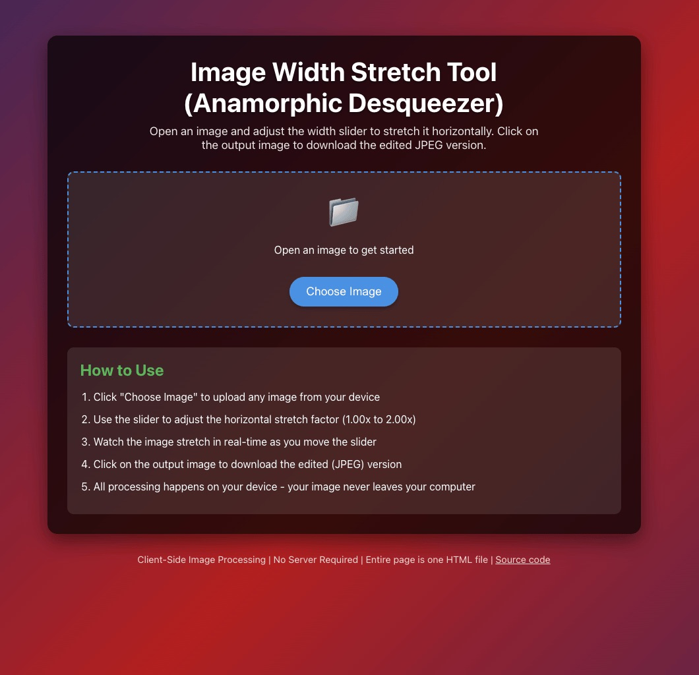
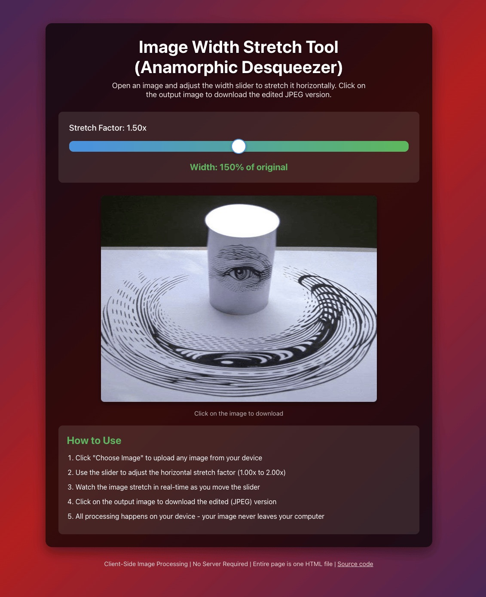

Desqueeze - Image Width Stretch Tool
====================================

[LIVE SITE](https://james2doyle.github.io/desqueeze/)

`Desqueeze` is a simple, client-side web page designed to help you stretch the width of images, particularly useful for "desqueezing" anamorphic footage or images. All image processing happens directly in your browser, ensuring your images never leave your device.

## Features

* **Client-Side Processing**: Your images are processed entirely within your browser. No server uploads, no data collection.
* **Real-time Preview**: Adjust the stretch factor with a slider and see the changes applied instantly.
* **Easy Download**: Click the output image to download the stretched version as a JPEG.
* **Single-File Application**: The entire page is contained within a single `index.html` file, making it highly portable and easy to use.
* **Intuitive Interface**: A straightforward design allows for quick image manipulation.

You can link to a specific pre-determined squeeze factor using a query string: https://james2doyle.github.io/desqueeze/?squeeze=1.33 will automatically set the slider to 1.33 when you open your image.

## How to Use

1. **Open an Image**: Click the "Choose Image" button to select an image file from your device.
2. **Adjust Stretch Factor**: Once an image is loaded, a slider will appear. Drag the slider to adjust the horizontal stretch factor from 1.00x (original width) to 2.00x (double the width).
3. **Preview**: The stretched image will be displayed in real-time as you move the slider.
4. **Download**: When you are satisfied with the result, click on the displayed output image to download it as a JPEG file. The downloaded file will be named with a timestamp, e.g., `1678886400000-desqueezed.jpeg`.

## Running Locally

Since `Desqueeze` is a single-file HTML page, you can run it directly from your local filesystem:

1. **Save the file**: Save the provided HTML code as `index.html` (from the `docs` folder) on your computer.
2. **Open in Browser**: Double-click the `index.html` file, or drag and drop it into your web browser (e.g., Chrome, Firefox, Safari). The page will load immediately.

## Technologies Used

Home grown plain HTML, CSS, and JavaScript
